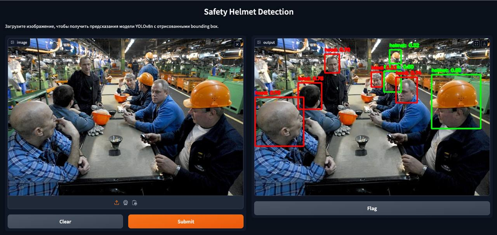

# SafetyHelmetDetection

**SafetyHelmetDetection** — это система мониторинга безопасности на рабочем месте, предназначенная для автоматического выявления отсутствия средств индивидуальной защиты (СИЗ), таких как защитные каски, у работников на заводах и других производственных предприятиях. Система использует технологии компьютерного зрения для обеспечения безопасности и предотвращения несчастных случаев.

## Цели проекта

Целью проекта является создание автоматизированной системы, которая:

- Обеспечивает мониторинг отсутствия защитных касок на рабочих.
- Снижает вероятность несчастных случаев на производственных объектах.
- Интегрируется с существующими системами мониторинга безопасности.

## Функциональные возможности

- Детекция отсутствия СИЗ, в частности защитных касок, с помощью алгоритмов компьютерного зрения.
- Возможность интеграции с камерами видеонаблюдения на производственных площадках.
- Алгоритм может быть использован в реальном времени для предупреждения о нарушениях.

## Стек технологий

- **Python** для разработки основного функционала.
- **OpenCV** для обработки изображений и видео.
- **PyTorch** для создания и обучения моделей машинного обучения.
- **YOLOv8** для детекции отсутствия СИЗ (например, касок) на изображениях.
- **Gradio** для создания веб-интерфейса.
- **Flask** для создания REST API.

## Установка

1. Клонируйте репозиторий:
   ```bash
   git clone https://github.com/muzafarovdan/SafetyHelmetDetection.git
   ```
2. Перейдите в каталог проекта:
   ```bash
   cd SafetyHelmetDetection
   ```
3. Установите зависимости:
   ```bash
   pip install -r requirements.txt
   ```

## Запуск Gradio приложения

1. Перейдите в каталог `inference`:
   ```bash
   cd inference
   ```
2. Запустите `gradio_app.py`:
   ```bash
   python inference/gradio_app.py
   ```
3. Откройте предоставленный URL в веб-браузере, чтобы загрузить изображение и получить предсказания модели.

## Структура проекта

- **`inference/gradio_app.py`** — скрипт для запуска веб-интерфейса с использованием Gradio.
- **`inference/app.py`** — скрипт для запуска REST API.
- **`requirements.txt`** — список зависимостей проекта.
- **`README.md`** — файл с информацией о проекте.

## Пример работы web сервиса на gradio

<p align="center">
  
</p>
<p align="center">
  <em>Результат работы web сервиса</em>
</p>

## Contribute

Если вы хотите внести свой вклад в проект, пожалуйста, создайте fork репозитория, сделайте изменения и создайте pull request. Убедитесь, что ваш код соответствует стилю и стандартам проекта.