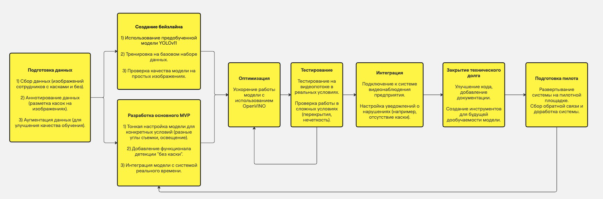
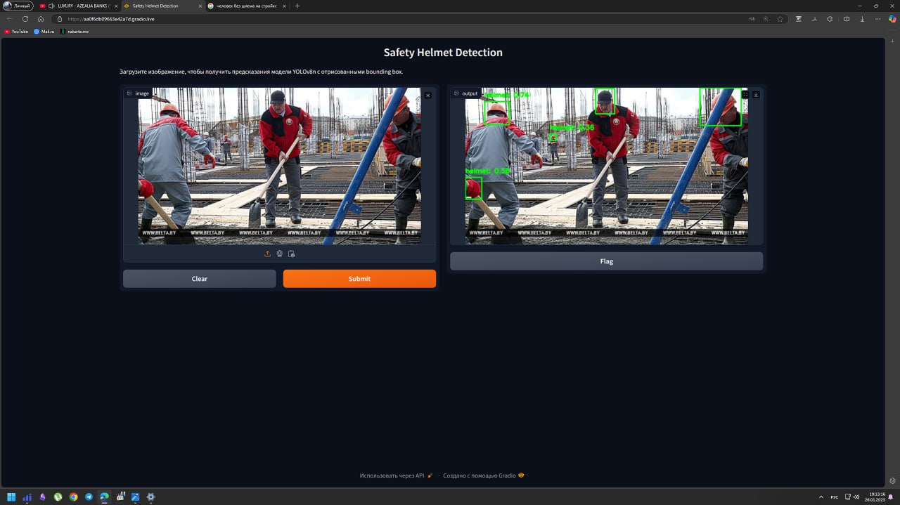
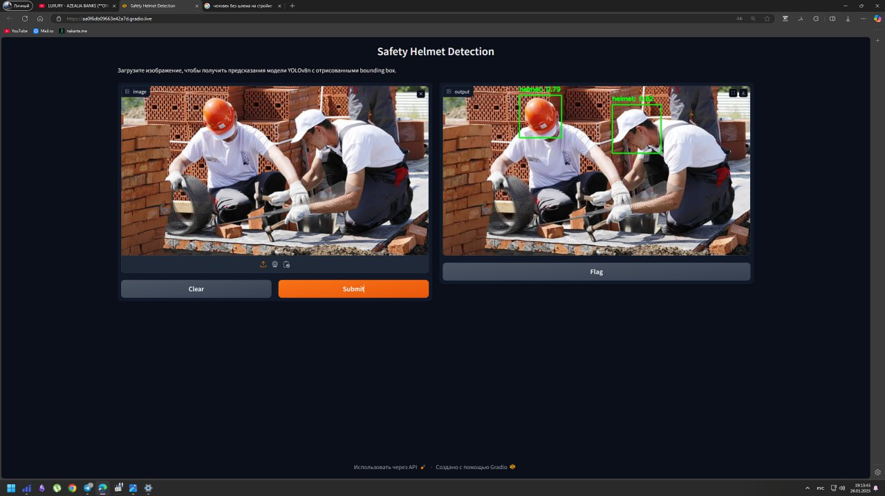
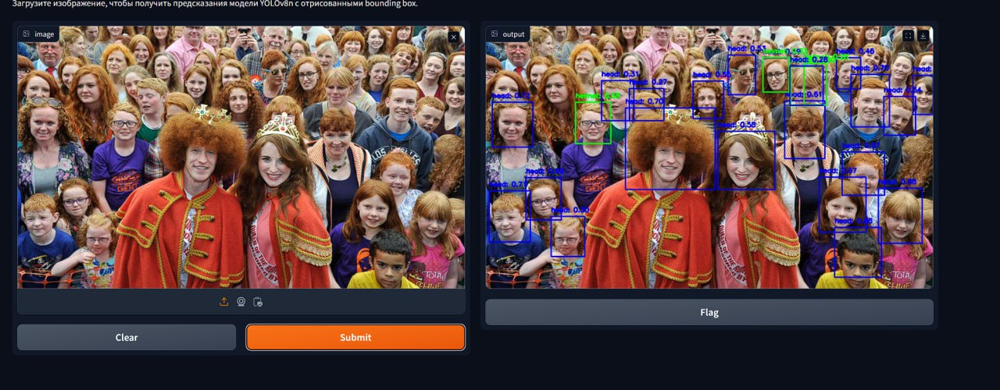
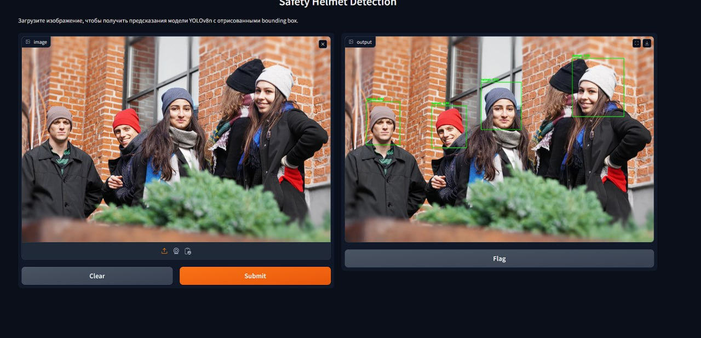
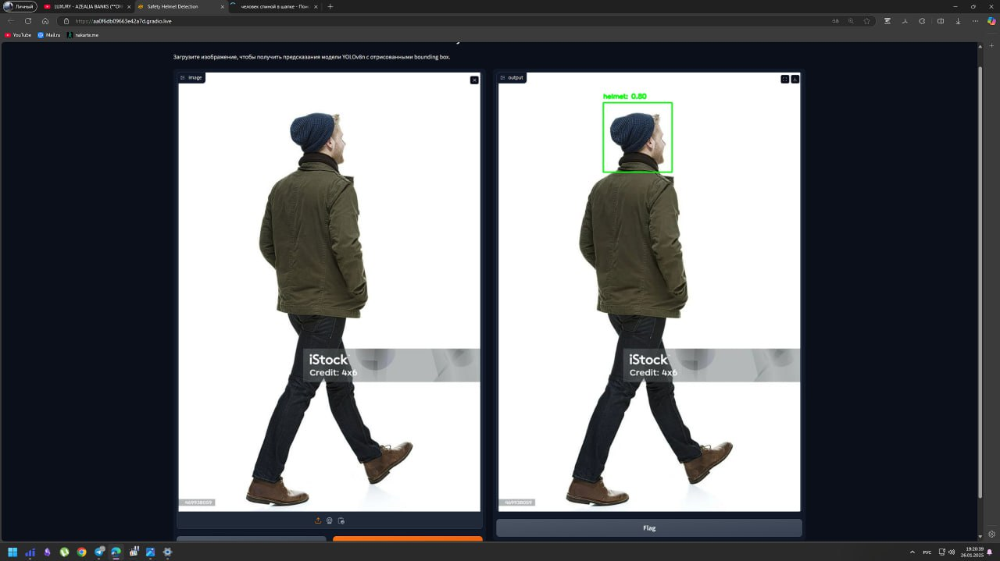
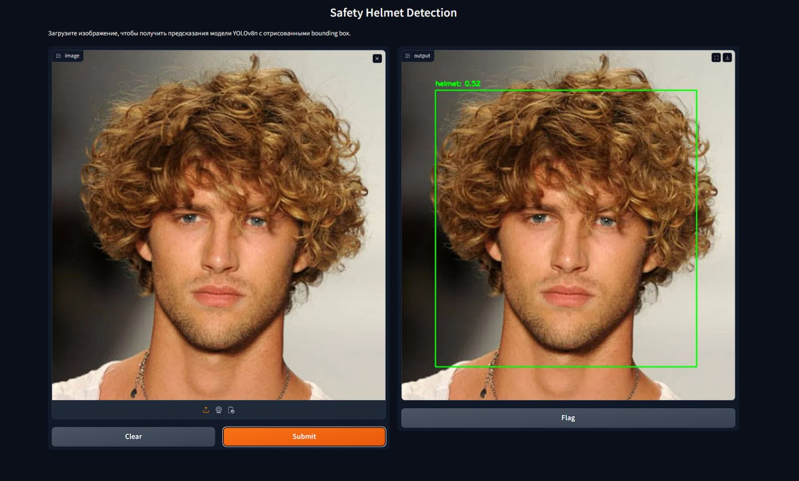

# ML System Design Doc - [RU]
## Дизайн ML системы - SafetyHelmetDetection

*Шаблон ML System Design Doc от телеграм-канала [Reliable ML](https://t.me/reliable_ml)*   

- Рекомендации по процессу заполнения документа (workflow) - [здесь](https://github.com/IrinaGoloshchapova/ml_system_design_doc_ru/blob/main/ML_System_Design_Doc_Workflow.md).  
- Детальный доклад о том, что такое ML System Design Doc и о том, как, когда и зачем его составлять - [тут](https://www.youtube.com/watch?v=PW9TGNr1Vqk).

### 1. Цели и предпосылки 
#### 1.1. Зачем идем в разработку продукта?  

- **Бизнес-цель**  

    Цель разработки продукта заключается в создании системы, которая улучшит процесс мониторинга безопасности на производственных объектах. В частности, система будет автоматически отслеживать отсутствие защитных касок у работников, что снизит вероятность несчастных случаев и повысит уровень безопасности на предприятиях.  

- **Почему станет лучше, чем сейчас, от использования ML**

    Текущие методы мониторинга безопасности могут включать только визуальные проверки или механизмы, основанные на датчиках, что требует времени и не всегда эффективно. Внедрение машинного обучения в эту задачу позволит:

    - Автоматизировать процесс мониторинга.
    - Повысить точность в распознавании отсутствия СИЗ (защитных касок) в различных условиях.
    - Обрабатывать данные в реальном времени, не привлекая дополнительных ресурсов для мониторинга.
    - Снизить количество человеческих ошибок и повысить эффективность системы.

    Машинное обучение в сочетании с компьютерным зрением позволяет создавать систему, которая не только распознает каски, но и быстро адаптируется к различным условиям, таким как освещение, угол камеры, разнообразие моделей касок и т. д.

- **Что будем считать успехом итерации с точки зрения бизнеса**

    Успехом итерации с точки зрения бизнеса будет являться:

    - Точное распознавание касок в 95% случаев при различных сценариях освещенности и угла обзора.
    - Снижение случаев несчастных случаев на производственных объектах за счет повышения эффективности мониторинга.
    - Интеграция с существующими системами безопасности с минимальными затратами на внедрение.

    Успех будет измеряться через метрики, такие как процент ошибок в распознавании, время реакции системы и влияние на снижение несчастных случаев.

#### 1.2. Бизнес-требования и ограничения  

- **Краткое описание БТ и ссылки на детальные документы с бизнес-требованиями** 

    - Бизнес-требования включают создание системы автоматического мониторинга для проверки отсутствия защитных касок у работников на производственных объектах.
    - Система должна быть интегрирована с видеонаблюдением, работая в реальном времени и обеспечивая высокую точность распознавания.
    - В случае обнаружения работников без касок, система должна немедленно оповещать оператора, чтобы тот принял меры.
    - Детальные бизнес-требования находятся в документе: [Ссылка на документ с бизнес-требованиями].

- **Бизнес-ограничения**

    - Система должна быть доступна для работы в условиях ограниченных вычислительных ресурсов на заводах и производственных объектах.

    - Требуется минимальная задержка в обработке изображений — система должна работать в реальном времени.

    - Внедрение должно быть выполнено без значительных изменений в существующих рабочих процессах (например, не требуется установка дополнительных камер или дорогостоящих датчиков).

    - Модель должна работать в разных условиях освещенности и при наличии различных типов касок, которые могут быть использованы на производстве.

- **Что мы ожидаем от конкретной итерации**

    - На текущей итерации от команды требуется разработка прототипа модели для распознавания отсутстия касок с точностью не менее 90% в тестовых условиях.

    - Модель должна продемонстрировать способность работать с реальными изображениями с камер видеонаблюдения.

    - Важно провести первичное тестирование модели на реальных данных с реальных объектов.

- **Описание бизнес-процесса пилота, насколько это возможно - как именно мы будем использовать модель в существующем бизнес-процессе?**

    - Пилотная версия системы будет использоваться в одном из производственных отделов для проверки работоспособности. Видеокамеры будут установлены в ключевых точках, где наблюдается высокая вероятность нарушений правил безопасности (например, на входах в опасные зоны).

    - Модель будет интегрирована с текущими камерами видеонаблюдения, и в случае обнаружения сотрудника без защитной каски система будет автоматически отправлять уведомление в реальном времени.

    - Ожидается, что в случае обнаружения нарушений система будет быстро реагировать, минимизируя время реакции для устранения инцидентов.

- **Что считаем успешным пилотом? Критерии успеха и возможные пути развития проекта**

    Успешный пилот будет оцениваться по следующим критериям:

    - Точность распознавания касок на уровне не менее 90% при разных условиях освещенности.
    Быстрота реакции системы — задержка не более 1-2 секунд на обработку кадра.
    - Минимизация ложных срабатываний (меньше 5%).

    В случае успешного пилота проект будет развиваться в следующие шаги:

    - Расширение на другие производственные отделы с улучшением точности системы.
    - Интеграция с системой предупреждения для оперативного реагирования на инциденты.
    - Оценка возможности интеграции с другими системами безопасности на предприятии (например, контроль доступа).

#### 1.3. Что входит в скоуп проекта/итерации, что не входит   

- **На закрытие каких БТ подписываемся в данной итерации**

    - В данной итерации мы планируем закрыть бизнес-требования, связанные с разработкой и тестированием модели для распознавания защитных касок (СИЗ) на рабочих местах с использованием видеонаблюдения.

    - Точность распознавания должна составлять не менее 90% при различных условиях освещенности.
    Интеграция модели с существующими системами видеонаблюдения на пилотном объекте.

    - Ожидается, что система сможет работать в реальном времени и уведомлять о нарушениях.

    - Реализация минимальной версии системы, которая может быть проверена в реальных условиях на одном из производственных объектов.

- **Что не будет закрыто**

    - В данной итерации не будет решаться проблема многоклассовой детекции, в частности распознавания различных типов СИЗ (кроме касок).

    - Модели не будут тестироваться и внедряться на всех производственных объектах, а только на одном пилотном объекте.

    - Не будет выполняться детальная настройка системы под изменения условий на других типах заводов.

    - Ожидается, что интеграция с другими системами безопасности (например, система контроля доступа) будет рассмотрена на более поздних этапах проекта.

    - Система не будет полностью адаптирована для работы в условиях сильных и динамичных изменений освещенности, таких как переход из яркой зоны в тень и наоборот.

- **Описание результата с точки зрения качества кода и воспроизводимости решения**

    - Результат итерации должен включать хорошо документированный и организованный код, который можно будет легко воспроизвести на другом оборудовании или в другой среде.

    - Модель и ее компоненты должны быть обучены, протестированы и проверены на наборе данных, который можно будет воспроизвести в будущем.

    - Результаты тестирования должны быть корректно сохранены и зафиксированы, включая точность модели, время обработки и другие метрики.

    - Должен быть настроен процесс автоматического тестирования, включая тестирование качества модели, а также проверки на наличие багов в коде (например, с использованием линтеров).

    - Используемые данные для обучения и тестирования должны быть легко доступными и описанными для дальнейшего использования.

- **Описание планируемого технического долга (что оставляем для дальнейшей продуктивизации)**

    Для дальнейшей продуктивизации будет оставлен технический долг, связанный с:

    - Оптимизацией производительности модели для работы в реальном времени, особенно на устройствах с ограниченными ресурсами.

    - Доработкой системы для работы в условиях различных типов освещенности и разнообразных углов обзора.

    - Расширением возможностей модели для распознавания других типов СИЗ, таких как жилеты, перчатки и т. д.

    - Повышением точности модели за счет использования большего объема данных и дополнительных техник, таких как аугментация данных и улучшение сетевой архитектуры.

    - Усовершенствованием пользовательского интерфейса для более удобного взаимодействия с системой.

    - Интеграцией с другими частями системы безопасности (например, системы оповещения и контроль доступа).

    - Проведением более глубокого тестирования системы в реальных рабочих условиях на других производственных объектах.

#### 1.4. Предпосылки решения  

- **Тип данных:**

    - Для обучения модели мы будем использовать видеоданные с камер наблюдения, установленных на производственном объекте. Видеофайлы будут содержать изображения рабочих, где они могут быть в различных позах и в разных условиях освещенности.

    - Дополнительно, для повышения точности модели, будут использоваться аннотированные изображения с метками, указывающими на наличие защитных касок на рабочих.

    - Все данные должны быть с минимальными искажениями (например, размытие, шум) и иметь соответствующие метки для дальнейшего обучения модели.1

- **Горизонт прогноза:**

    - Модель будет работать в режиме реального времени, что означает, что прогнозы будут делаться для каждого кадра видео на протяжении рабочего дня.

    - Модели не будут делать долгосрочные прогнозы, как в случае с прогнозированием поведения пользователей или долговременными прогнозами.

- **Гранулярность модели:**

    - Модель будет оценивать наличие защитных касок в индивидуальном масштабе, то есть на каждом рабочем месте в отдельности.

    - Прогнозы будут делаться для каждого рабочего, который будет в поле зрения камеры, с возможностью уведомления, если каска не обнаружена на человеке.

    - Модели не будут учитывать взаимодействия между рабочими (например, какие-либо коллективные действия или их поведение).

- **Параметры качества данных:**

    - Ожидается, что изображения будут сделаны при нормальном освещении и без существенных искажений. Камеры видеонаблюдения должны быть настроены на стандартное разрешение (например, 1080p).

    - Для обучения модели используется набор данных, который должен включать разнообразие изображений с различными углами зрения и условиями освещенности.

- **Использование данных в реальном времени:**

    - Прогнозы от модели будут использоваться в реальном времени, и система должна успевать обрабатывать данные с камер наблюдения с минимальной задержкой (не более нескольких секунд на кадр).

    - Важно обеспечить минимальное количество ложных срабатываний и пропусков в детекции.

- **Интерфейсы для работы с моделью:**

    - Интерфейс модели будет интегрирован с существующими системами безопасности на объекте. Ожидается, что система будет передавать информацию о нарушениях в реальном времени и генерировать уведомления для операторов.

    - Прогнозы модели должны быть легко интерпретируемыми, чтобы операторы могли принимать быстрые и обоснованные решения.

- **Ожидаемые условия эксплуатации:**

    - Модель должна работать на устройствах с ограниченными вычислительными мощностями, таких как видеорегистраторы или серверы, работающие в условиях производственной среды.

    - Прогнозы должны генерироваться без значительных задержек, чтобы система могла использовать модель в реальном времени.

- **Обоснование от запроса бизнеса:**

    - Бизнес требует, чтобы система могла эффективно работать в реальном времени и интегрироваться с текущими системами видеонаблюдения. Также, необходимо обеспечить минимальное вмешательство оператора и быстрое реагирование на нарушение правил безопасности.

    - Для обеспечения безопасности рабочих, система должна предупредить оператора или рабочего о необходимости ношения каски в момент, когда это происходит, и помочь предотвратить несчастные случаи.

### 2. Методология     

#### 2.1. Постановка задачи  

- **Цель:** Создать систему автоматической детекции средств индивидуальной защиты (СИЗ), в частности, защитных касок, с использованием методов компьютерного зрения для мониторинга рабочих на производственных объектах.

- **Задачи с технической точки зрения:**

    ##### **Детекция объектов:**

    - Разработать модель, способную определять наличие или отсутствие защитной каски на изображении или видеокадре.
    - Модель должна быть обучена на заранее размеченных данных, где защитные каски выделены в качестве ключевых объектов.

    ##### **Классификация:**

    - Научить систему различать рабочих с каской и без неё, а также игнорировать другие нерелевантные объекты на изображении (например, станки, оборудование, элементы одежды).

    ##### **Обработка данных в реальном времени:**

    - Обеспечить способность модели обрабатывать видеопоток с минимальной задержкой, чтобы гарантировать оперативное выявление нарушений.

    ##### **Интеграция с камерами:**

    - Настроить систему для работы с видеоданными, поступающими от существующих камер наблюдения.

    ##### **Генерация алертов:**

    - Разработать механизм для создания уведомлений при обнаружении нарушения (например, если рабочий без каски находится в опасной зоне).

    ##### **Учет производственных условий:**

    - Учесть различные условия освещения, ракурсы и возможные препятствия (например, частичное перекрытие каски другими объектами).

    ##### **Масштабируемость:**

    - Проектировать систему с возможностью дальнейшего расширения функционала, например, для детекции других видов СИЗ (перчатки, защитные очки и т.д.).

- **Тип задачи:**

    - **Задача детекции объектов:** Система должна определять местоположение и класс объектов (в данном случае — наличие или отсутствие каски).

    - **Задача классификации:** Система должна различать, соответствует ли объект (человек) требованиям безопасности.

- **Выходные данные модели:**

    - Координаты bounding box для объектов (например,касок) на изображении.
    - Класс объекта: HelmetDetected или NoHelmet.
    - Уровень уверенности модели в прогнозе.

- **Ключевые требования:**

    - Высокая точность (>90%) детекции и классификации.
    - Минимальный уровень ложных срабатываний (<5%).
    - Быстрая обработка: не более 100 мс на изображение.
    - Легкая интеграция с бизнес-процессами и возможность масштабирования.


#### 2.2. Блок-схема решения  

<div style="text-align: center;">
    
    <p>Предварительная блок-схема решения</p>
</div>

#### 2.3. Этапы решения задачи

##### Этап 1. Подготовка данных

- **Описание данных/сущностей:**
    - Данные содержат изображения рабочих на производственных объектах с аннотациями в формате XML.
    - Аннотации включают bounding boxes и классы объектов, такие как "head" и "person".
    - Объем данных: Достаточный для начального этапа, но может потребоваться расширение при обучении более сложных моделей.
    - Качество данных: Возможны ошибки разметки (неточные bounding boxes) и разнообразие условий съемки (разные углы и освещенность).
    - Выявлен дисбаланс классов (например, меньше примеров без касок). Также встречаются маленькие объекты на изображениях, сложных для детекции.

- **Процесс генерации данных:**
    - Данные поступают из систем видеонаблюдения производственных объектов.
    - Формат: изображения в ```.jpg``` и аннотации в ```.xml```.
    - Аннотации созданы вручную или автоматически с последующей проверкой. Этот процесс нерегулярный — разметка выполняется на этапе подготовки, но возможна доработка при обнаружении ошибок.
    - Если данных недостаточно, можно использовать аугментацию (повороты, изменение яркости) или дополнить набор снимками из других камер/объектов.

**Решение проблемы недостатка данных:**
    - Методы: аугментация, поиск дополнительного датасета, 
    привлечение асессоров для разметки новых изображений.

- **Решение проблемы дисбаланса классов:**
    - В ходе EDA было выявлено, что в датасете наблюдается дисбаланс классов с перевесом в сторону аннотаций с касками. 
    - Для выравнивания классов можно обогатить датасет заимствованием изображений людей без касок из других датасетов, но лучше всего использовать данные с камер видеонаблюдения.
    - Важно, чтобы новые данные были тщательно проверены и аннотированы, чтобы избежать значительного сдвига домена. Это можно сделать с помощью авторазметки с последующей ручной валидацией асессоров.

- **Риски использования данных из другого домена:**
    - Использование данных, снятых не с камер видеонаблюдения, может привести к сдвигу домена, что повлияет на обобщающую способность модели в нашей задаче.
    - Риски включают снижение точности модели на реальных данных с камер видеонаблюдения из-за различий в условиях съемки, таких как освещение, угол обзора и качество изображения.
    - Сложность интерпретации результатов работы модели на разных датасетах.
    - Для минимизации этих рисков необходимо:
        - Проводить регулярное тестирование модели на данных, максимально приближенных к реальным условиям.
        - Если нет возможности получить данные именно с камер видеонаблюдения, то возможно поможет fine-tuning/transfer learning модели на небольшом наборе данных, снятых с камер видеонаблюдения.
    - На следующих этапах важно получить данные именно с камер видеонаблюдения.


- **Ожидаемый результат этапа:**
    - Отчет о качестве данных, включая найденные проблемы и их решения.
    - Подготовленные данные, готовые для обучения модели.

##### Этап 2. Подготовка прогнозных моделей

- **Описание ML-метрик и функций потерь, выбранных для решения задачи:**

    - **mAP (mean Average Precision):** метрика, используемая для оценки качества детекции объектов. Она показывает среднюю точность по всем классам.
    - **IoU (Intersection over Union):** метрика, определяющая перекрытие между предсказанным и истинным ограничивающим прямоугольником (bounding box).
    - **Precision и Recall:** важны для оценки количества ложных положительных и ложных отрицательных срабатываний, что критично для применения в реальных ситуациях безопасности.
    - **YOLO Loss.** Эта функция потерь включает в себя ошибки классификации, координат предсказанных рамок и ошибки по IoU.

- **Описание схемы ML-валидации:**
    - Разделение данных на тренировочный, валидационный и тестовый наборы с учетом дисбаланса классов.
    - Периодическое обновление тестового набора для проверки обобщающей способности модели.
- **Описание структуры бейзлайна:**
    - Модель на базе YOLOv8, использующая предобученные веса для ускорения обучения.
    - Предобработка данных: изменение размера изображений, нормализация, стандартные аугментации (например, горизонтальные повороты, изменения яркости).
    - Бейзлайн должен достичь mAP >= 0.5 и Precision >= 0.9.

- **Стратегии дальнейшего развития решения:**
    - Эксперименты с проверкой других архитектур для нашей задачи.
    - Эксперименты с предобработкой данных, возможно стоит попробовать другой подход.
    - Feature Engineering (FE). Эксперименты с добавлением новых фичей.
    - Подбор оптимальных гиперпараметров для модели.

- **Риски данного этапа и способы их снижения:**
    - **Недостаточная точность детекции:** Это может произойти, если модель плохо обрабатывает разнообразие условий на изображениях.
    - **Высокий уровень ложных положительных:** когда модель ошибочно классифицирует объекты, не являющиеся касками, как каски.
    - **Способы снижения рисков:** добавление новых данных для обучения, коррекция обучающих данных, настройка гиперпараметров.

- **Необходимый результат этапа:**
    - Рабочая модель, способной эффективно детектировать отсутствие касок на изображениях.
    - Оптимизированная модель, готовая к использованию в реальных условиях, с минимизацией ошибок (ложных отрицательных и ложных положительных).

- **Этапы, специфичные для этой задачи:**
    - Плохая видимость, частичное закрытие каски объектами.
    - Генерация оповещений: разработка модуля для генерации уведомлений в реальном времени при обнаружении нарушений.
### 3. Подготовка пилота

#### 3.1. Способ оценки пилота

#### Краткое описание предполагаемого дизайна и способа оценки пилота:

Пилотный проект будет развернут на одном из производственных объектов, где установлены камеры видеонаблюдения. Система будет интегрирована с существующими камерами для мониторинга рабочих зон. Оценка пилота будет проводиться на основе следующих шагов:

- **Сбор данных:** Видеопоток с камер будет использоваться для тестирования модели в реальных условиях. Данные будут собираться в течение определенного периода времени для обеспечения репрезентативности.
- **Тестирование модели:** Модель будет работать в режиме реального времени, анализируя видеопоток и выявляя случаи отсутствия касок у работников.
- **Сбор метрик:** Будут собираться метрики точности, такие как mAP, Precision, Recall, а также будут замеряться RPS/FPS.
- **Анализ результатов:** Результаты будут анализироваться для выявления сильных и слабых сторон модели. Особое внимание будет уделено случаям ложных срабатываний и пропусков.

#### 3.2. Что считаем успешным пилотом

#### Формализованные в пилоте метрики оценки успешности

Успешный пилот будет оцениваться по следующим критериям:

- **Точность распознавания касок:** Достижение точности не менее 90% при различных условиях освещенности и углах обзора.
- **Скорость обработки:** Время обработки каждого кадра не должно превышать 1-2 секунд, чтобы обеспечить работу в реальном времени.
- **Минимизация ложных срабатываний:** Доля ложных срабатываний должна быть менее 5%.
- **Интеграция с существующими системами:** Система должна быть легко интегрирована с текущими системами видеонаблюдения и безопасности.
- **Положительная обратная связь:** Операторы должны подтвердить, что система помогает в улучшении безопасности и снижении количества инцидентов.

#### 3.3. Подготовка пилота

Что можем позволить себе, исходя из ожидаемых затрат на вычисления:

- **Оценка вычислительной сложности:** На этапе экспериментов с бейзлайном будет проведена оценка вычислительной сложности модели. Это позволит определить, какие ресурсы необходимы для развертывания системы в реальных условиях.
- **Оптимизация модели:** В случае необходимости, модель будет оптимизирована для работы на устройствах с ограниченными ресурсами, таких как видеорегистраторы или серверы на производственных объектах.
- **Установка ограничений:** Будут установлены ограничения по вычислительной сложности, чтобы обеспечить работу системы в реальном времени без значительных задержек.
- **Планирование ресурсов:** На основе оценки вычислительной сложности будет спланировано использование ресурсов, включая серверы и сетевую инфраструктуру, для поддержки пилотного проекта.

### 4. Внедрение для production систем

#### 4.1. Архитектура решения

- **Модуль детекции касок:** Использует модель YOLOv8 для анализа видеопотока и выявления отсутствия касок.
- **API-сервис**: Обеспечивает взаимодействие с другими системами через REST API. Предоставляет методы для получения предсказаний и управления системой.
- **Система уведомлений:** Отправляет оповещения операторам в случае обнаружения нарушений.
- **Интерфейс мониторинга:** Веб-интерфейс для операторов, позволяющий отслеживать состояние системы и получать отчеты.

#### 4.2. Описание инфраструктуры и масштабируемости

- **Выбор инфраструктуры:**
    - Для развертывания системы выбрана облачная платформа, такая как AWS или GCP, что обеспечивает гибкость и масштабируемость. Используются контейнеры Docker для изоляции и легкости развертывания.

- **Плюсы и минусы выбора:**
    - **Плюсы:** Высокая доступность, легкость масштабирования, интеграция с другими облачными сервисами.
    - **Минусы:** Зависимость от облачного провайдера, возможные задержки из-за сетевых ограничений.

- **Почему финальный выбор лучше других альтернатив:**
    - Облачная инфраструктура позволяет быстро адаптироваться к изменяющимся требованиям и обеспечивает надежность и безопасность данных.

#### 4.3. Требования к работе системы
- SLA: 99.9% доступности.
- Пропускная способность: Обработка до 1000 изображений в минуту.
- Задержка: Не более 1 секунды на обработку одного кадра.

#### 4.4. Безопасность системы
- Защита API от несанкционированного доступа с использованием токенов аутентификации.
- Регулярные обновления и патчи для устранения уязвимостей.

#### 4.5. Безопасность данных
- Все данные обрабатываются в соответствии с законами РФ. Личные данные не сохраняются, и все изображения обрабатываются в режиме реального времени без хранения.

#### 4.6. Издержки
- Оценка издержек включает стоимость облачных ресурсов, лицензий на ПО и поддержку. На даннный момент сложно оценить стоимость.

#### 4.7. Integration points
- API-сервис: Предоставляет методы для получения предсказаний (/predict) и управления системой.
- Система уведомлений: Интегрируется с API для отправки оповещений.
- Интерфейс мониторинга: Использует API для отображения состояния системы и отчетов.

#### 4.8. Риски
- Технические риски: Возможные сбои в работе модели при изменении условий освещенности или углов обзора.
- Операционные риски: Зависимость от облачного провайдера и возможные задержки в сети.
- Юридические риски: Соблюдение всех нормативных требований и защита данных.

### 5. Выявленные несовершенства при тестировании сервиса

- Модель ошибается на людях, у которых вместо каски надета шапка или кепка.
- Модель ошибается на людях, у которых длинные и объемные волосы.
- Модель ошибается на рыжих людях, путая их волосы с каской.

#### Примеры ошибочных распознаваний:

<p align="center">
  
</p>

<p align="center">
  
</p>

<p align="center">
  
</p>

<p align="center">
  
</p>

<p align="center">
  
</p>

<p align="center">
  
</p>


